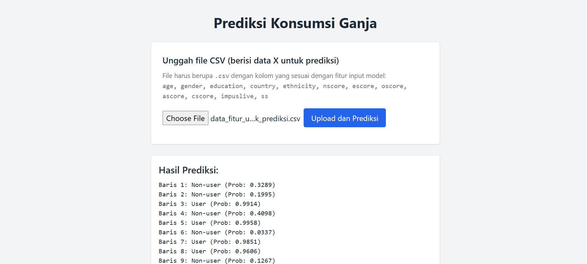

# 🚀 Drug Consumption Predictor

**Live Demo:** [**https://huggingface.co/spaces/puunnu/drug-consumption-predictor**](https://huggingface.co/spaces/puunnu/drug-consumption-predictor)




---

### 📝 Ringkasan Proyek

**Drug Consumption Predictor** adalah sebuah aplikasi web berbasis *machine learning* yang bertujuan untuk memprediksi apakah seseorang merupakan pengguna ganja (cannabis) atau bukan. Prediksi ini dibuat berdasarkan serangkaian data demografis (seperti usia dan pendidikan) dan skor dari tes kepribadian responden.

Proyek ini menggunakan model **LightGBM** yang telah dilatih pada dataset *'Drug Consumption (Quantified)'* dari UCI Machine Learning Repository. Sebuah pipeline *end-to-end* dibangun untuk mencakup seluruh proses, mulai dari *preprocessing* data hingga *tuning hyperparameter* untuk memastikan performa yang optimal. Aplikasi ini kemudian di-deploy sebagai layanan web interaktif di Hugging Face Spaces.

---

### ⚙️ Tech Stack & Tools

-   **Machine Learning**: Scikit-learn, LightGBM, Pandas, Joblib
-   **Backend & Frontend**: FastAPI, Uvicorn, HTML, JavaScript
-   **Deployment**: Docker, Hugging Face Spaces
-   **Dataset**: [Drug Consumption (Quantified) - UCI Repository](https://archive.ics.uci.edu/dataset/373/drug-consumption-quantified)

---

### 📂 Struktur Proyek

Struktur proyek ini dirancang untuk memisahkan kode aplikasi dari file-file lainnya, yang merupakan praktik pengembangan yang baik.

```
/
├── app/
│   ├── main.py                 # File utama FastAPI (Backend & Frontend Server)
│   ├── index.html              # Halaman antarmuka pengguna (Frontend)
│   ├── pipeline_konsumsi_narkoba_lightgbm.joblib  # Model pipeline terlatih
│   ├── label_encoder.joblib    # Encoder untuk label target
│   └── requirements.txt        # Daftar dependensi Python
│
├── Dockerfile                  # Instruksi untuk membangun lingkungan aplikasi
├── daftar_fitur_untuk_prediksi.csv          # Contoh file input untuk pengujian
├── drug_consumption_classification_pipeline_gridsearch.ipynb       
└── README.md                   # Dokumentasi proyek (file ini)

```

---

### 🧠 Model & API


### Alur Pembangunan Model (Model Development Workflow)
Model prediksi ini dibangun melalui serangkaian proses yang sistematis untuk memastikan hasil yang robust dan dapat direproduksi.

**1. Preprocessing dan Transformasi Data**
Langkah awal adalah mempersiapkan data agar siap untuk pemodelan.
* **Target Binarization**: Variabel target asli, `cannabis`, memiliki 7 level penggunaan (dari CL0 hingga CL6). Untuk menyederhanakan masalah menjadi klasifikasi biner, kelas-kelas ini dikelompokkan menjadi dua: **'Non-user'** (untuk kelas CL0 dan CL1) dan **'User'** (untuk kelas CL2 hingga CL6).
* **Feature Scaling**: Semua fitur input yang bersifat numerik (skor kepribadian dan data demografis) distandarisasi menggunakan `StandardScaler`. Hal ini penting untuk memastikan semua fitur memiliki skala yang sama, yang dapat meningkatkan performa model seperti LightGBM.

**2. Konstruksi Pipeline yang Robust**
Untuk menjaga integritas data dan membuat alur kerja yang efisien, sebuah `Pipeline` dari Scikit-learn digunakan.
* **Tujuan**: Pipeline ini menggabungkan langkah *feature scaling* (`StandardScaler`) dan pemodelan (`LGBMClassifier`) menjadi satu objek tunggal.
* **Keunggulan**: Pendekatan ini secara efektif **mencegah kebocoran data (*data leakage*)** dari set pengujian ke set pelatihan dan memastikan bahwa proses yang sama diterapkan secara konsisten saat pelatihan dan prediksi.

**3. Pencarian Hyperparameter (Hyperparameter Tuning)**
Model `LGBMClassifier` dipilih karena performanya yang tinggi dan efisiensinya dalam memproses data. Untuk menemukan konfigurasi terbaik, `GridSearchCV` diterapkan.
* **Proses**: `GridSearchCV` secara sistematis menguji berbagai kombinasi hyperparameter, menggunakan validasi silang 5-fold (*5-fold cross-validation*).
* **Parameter yang Diuji**: Termasuk `n_estimators` (50, 100, 200), `learning_rate` (0.01, 0.1, 0.3), dan `max_depth` (3, 6, 9).
* **Hasil Terbaik**: Kombinasi optimal yang ditemukan adalah `learning_rate: 0.3`, `max_depth: 3`, dan `n_estimators: 100`.

**4. Evaluasi Performa Model**
Performa model final dievaluasi pada data uji (20% dari total data) yang belum pernah dilihat sebelumnya.
* **Metrik Utama**: **F1-Score (weighted)** dipilih sebagai metrik evaluasi utama karena memberikan gambaran yang seimbang antara presisi dan recall, terutama untuk data yang mungkin tidak seimbang.
* **Hasil**: Model mencapai **weighted F1-Score 0.78** pada data uji. Secara spesifik, model menunjukkan performa yang baik dalam mengidentifikasi kelas 'User' (F1-score 0.82) dan kelas 'Non-user' (F1-score 0.68), yang menunjukkan kemampuannya dalam menangani kedua kasus.

**5. Analisis Fitur Penting**
Setelah model dilatih, analisis *feature importance* dilakukan untuk memahami faktor-faktor apa yang paling berpengaruh.
* **Temuan**: Skor kepribadian, terutama **`nscore` (neuroticism), `cscore` (conscientiousness), dan `ascore` (agreeableness)**, ditemukan sebagai prediktor yang jauh lebih kuat dibandingkan dengan data demografis seperti usia atau jenis kelamin. Ini memberikan wawasan berharga mengenai profil psikologis yang terkait dengan penggunaan ganja.

#### Detail Aplikasi Web
Aplikasi ini dibangun menggunakan **FastAPI** dan melayani dua hal utama:

* **Frontend (`GET /`)**: Saat pengguna mengunjungi URL utama, server akan menyajikan halaman `index.html` yang interaktif.
* **API Backend (`POST /predict-batch`)**: Halaman frontend akan mengirim file CSV ke endpoint ini. Backend kemudian memproses file menggunakan model yang telah dimuat dan mengembalikan hasil prediksi dalam format JSON untuk ditampilkan kembali di halaman web.

---

### 🚀 Cara Menggunakan Demo

1.  Kunjungi tautan **Live Demo** di atas.
2.  Gunakan file `daftar_fitur_untuk_prediksi.csv` yang ada di repositori ini atau siapkan file CSV Anda sendiri dengan format yang sesuai.
3.  Pada halaman web, klik tombol untuk memilih file, lalu klik "Prediksi".
4.  Hasil prediksi akan muncul di bawah tombol dalam format yang mudah dibaca.

---

### 🙋 Kontak

**Muhammad Naufal Aqil**
-   **Email**: muhammadnaufalaqil20@gmail.com
-   **GitHub**: [Naufal22](https://github.com/Naufal22)
-   **LinkedIn**: [Muhammad Naufal Aqil](https://www.linkedin.com/in/muhammad-naufal-aqil-b6114424a/)
